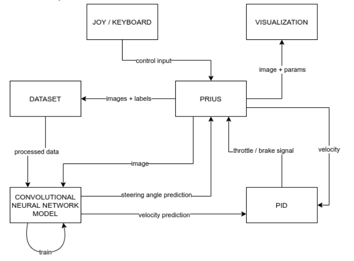

# autonomous_vehicle

The goal of the project is to build a platform that will simulate an autonomous vehicle. The platform should provide essential functionality:
- controlling the vehicle
- collecting the data
- autonomous ride

The following image shows the concept of the simulation platform:

- Prius block - a vehicle with access to steering inputs, odometry and images from cameras
- Joy/Keyboard block - Controlling the vehicle, changing vehicle ride mode (manual/autonomous), turning on/off collecting the data
- Visualization block - Visualizing current velocity, drive mode, steering inputs on front camera image
- Dataset block - collecting the images and labels used to train the CNN model.
- Convolutional Neural Network Model - The trained model that returns the predicted steering angle and vehicle based on input image. The vehicle should ride autonomously after turing on corresponding mode
- PID - the predicted vehicle speed needs to be converted to steering inputs

## Dependencies
- Ubuntu 18.04 or Ubuntu 20.04
- Docker

## First run
The commands run in host are marked as **H** and the commands from terminal are marked as **C**

- Clone the repository
- Go to the `docker` directory - `H$ cd docker`
- Build the docker image - `H$ ./build.sh` 
- Run the container using `H$ run_cpu.sh` or `H$ run_gpu.sh`
- Go to main workspace `C$ cd /av_ws`
- Initialize and build the workspace (It might take long) `C$ catkin init`, `C$ catkin build`
- Load environment variables `C$ source/av_ws/devel/setup.bash`
- Run demo package `C$ roslaunch car_demo demo.launch`
- [Save the docker container](#saving-docker-container)
- Close the container 
- Create workspace on your local machine `H$ mkdir -p ~/av_ws/src`
- Move the `av_03` and `av_msgs` folder to `H$ ~/av_ws/src` directory
- Make sure that `--volume` arguments in `docker/run_gpu.sh` or `docker/run_cpu.sh` points to the correct directories containing `av_03` and `av_msgs`
    * Sometimes you need to change $USER value to your real username
- Run the container `H$ run_cpu.sh` or `H$ run_gpu.sh`
- Go to the main workspace directory and then to `av_03` package and see if the files are there
```
C$ cd /av_ws/src/av_03/
C$ ls
```

## Running the package
- Run the docker container
- Go to the workspace directory
- Download the trained model and put it in `cnn_models` in `av_03` package 
- Build catkin package
```
C$ catkin build
```
- Source the environment
```
C$ source devel/setup.bash
```
- Launch the demo
```
C$ roslaunch av_03 av.launch
```

## Saving docker container
```
H$ docker container ps
H$ docker commit container_name av:master
```